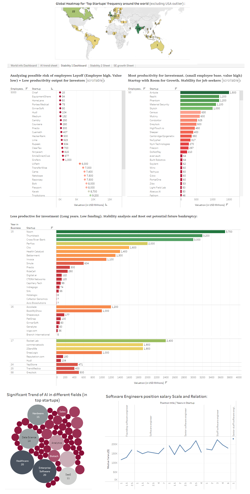

## Astute Startups Insighter (ASI) - A Data Analysis Project

## Problem Statement
The objective of this project is to use Data Scraping to gather information of Top 1207 Startups and corresponding 500 software engineers from [this website](https://topstartups.io/) & then apply Data Analysis. This was a dynamic website. As well as the data placement was also challengingly dynamic in the html structure. These facts were handled while scraping with selenium. Afterwards, I implemented data processing to engineer new features for upcoming analysis, and standardize data such as currency data. etc. <br/> 
Later I utilized the scraped data providing insights to both investors and job seekers, employees, stakeholders simultaneously( encompassing all workforce & resource level) by applying data science to understand following key points using Tableau Dashboard and data analysis   : 

1. Startup frequency data Heatmap in a map and bar chart of country frequency (excluding USA for unbiased heatmap)
2. A bubble plot that can display current use of AI in top startup fields
3. When a company is in potential risk to lay off employees? important to know for a company. (employee generated USD valuation as metric)
4. Which company is very productive for investment, job seekers. (employee generated valuation as metric)
5. Does a startup have room for growth (employee generated valuation as metric)
6. Which time company is risk prone to future bankruptcy (Years generated valuation as metric)
5. salary scale of employees in different positions e.g. software engineers and how they connect with each other from salary dimension

You can visit the Tableau public dashboard [here](https://public.tableau.com/app/profile/tanvir.ishraq.khan/viz/AstuteStartupsInsighter-Aprojectforinvestorssoftwareengineerssimultaneously/Stability2Sheet?publish=yes). Be mindful that the dashboard contains multiple tabs. Each Tab used to find different new insights. It is suggested to use the fullscreen (available at bottom right) for a better overarching view.<br><br>
Dashboard preview: (visit the actual dashboard [here in Tableau](https://public.tableau.com/app/profile/tanvir.ishraq.khan/viz/AstuteStartupsInsighter-Aprojectforinvestorssoftwareengineerssimultaneously/Stability2Sheet?publish=yes)) <br>


## Insights, Findings and Observations from the [Dashboard](https://public.tableau.com/app/profile/tanvir.ishraq.khan/viz/AstuteStartupsInsighter-Aprojectforinvestorssoftwareengineerssimultaneously/Stability2Sheet?publish=yes)
1. Besides other countries, Interestingly India is a melting point of new startups. There should be new opportunities for investors. But this high number calls for research on stability and security first before investing. <br>
Job seekers around the corresponding economic level can also be aware of the fact that this area will be hiring.
2. One of the top trends of AI use is in healthcare. AI has found its way into the healthcare system even though there is a supposed ethical consideration regarding adopting AI into healthcare without professional (e.g. Doctor) supervision and it was shunned at the beginning. <br>
Also, Hardware is progressively adopting AI. Hardware is one of the top fields.
3. This analysis distinguished when startups could be at potential risk to lay off employees, located at the top. (High amount of Employees. low startup Valuation). This is useful information for company to know, both investors and job seekers, employees, and stakeholders to understand the stability and security. And take pre-emptive care of the company.
4. This analysis distinguished startups that despite being very productive still should have more room for growth located at the top (Low amount of Employees. Great startup Valuation). Providing useful information for both investors and job seekers, employees to understand the stability and security of a startup.
5. Analyzed startups to estimate potential future bankruptcy possibilities to look out for given a set of years. These startups are Located at the bottom for each group of "years in business" (Long years of business yet yielding low amount valuation compared to peers). Important for startup directors, employees at risk of lay off and investors.
6. Software Engineer's position salary Scale and Relation valued and serialized. Important understanding for job holders. Giving an idea of how much value they shall be making and the upgrade path. This nature of analysis can be applied to any other position e.g. finance, marketing team, project managers etc for the whole company as long as there is access to the data.


## Build From Sources and using the Selenium Scraper
1. Clone the repo
```bash
git clone https://github.com/tanvir-ishraq/Astute-Startups-Insighter-ASI-Data-Science.git
```
2. Intialize and activate virtual environment
```bash
virtualenv --no-site-packages  venv
source venv/bin/activate
```
3. Install dependencies. It is highly suggested to use a virtual environment.
```bash
pip install -r requirements.txt
```
4. Download Chrome WebDrive from https://chromedriver.chromium.org/downloads 
5. Run the scraper:
```bash
python ASI_scraper/ASI_scraper.py --chromedriver_path <path_to_chromedriver>
```
6. You will get 3 files named `Top_startups_details_dataset_complete.csv`, `SE_in_startups_dataset.csv`, `AI_field_trend_dataset.csv` containing all the required fields. 
Alternatively, check all the scraped data [here](https://github.com/tanvir-ishraq/Astute-Startups-Insighter-ASI--a-Data-Analysis-Project-for-Investors-and-Software-Engineers/tree/main/datasets). 
